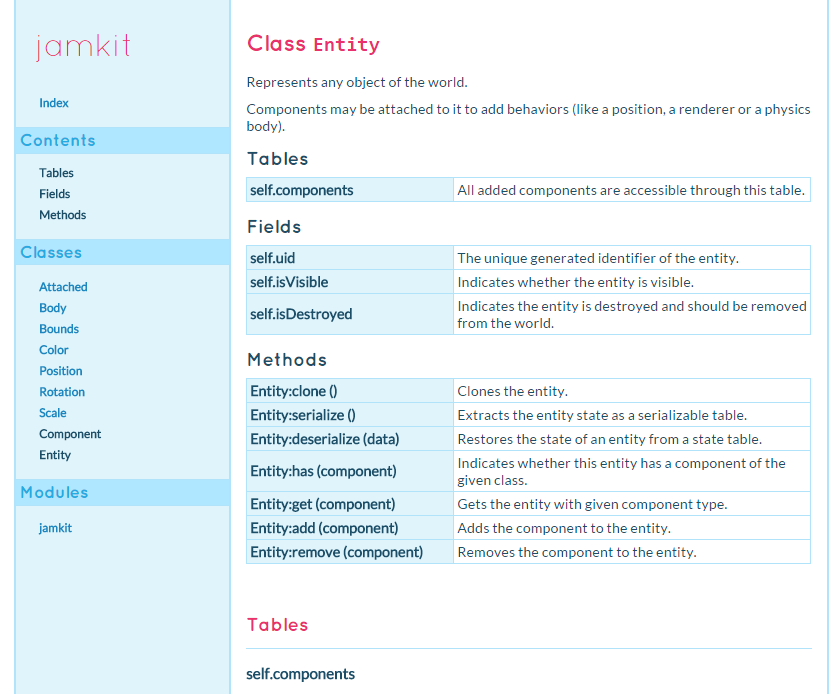

# ldoc-styles

Various ldoc lua documentation stylesheets.

## Usage

`ldoc -s <path to style directory containing the css file>`

## Themes

### `love`

A theme created for generating documentation for [LÖVE](https://love2d.org/) libraries.

## Copyright and license

MIT © [Aloïs Deniel](http://aloisdeniel.github.io)